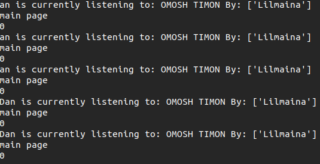

# **ESPOTIPY**
</img>
</img>
</img>
</img>
## ToDo
- [x] Consumes json metadata from spotify's web api on the esp32
- [x] Display users currently playing track on an oled display connected to the esp32 ()
- [ ] Control playback
